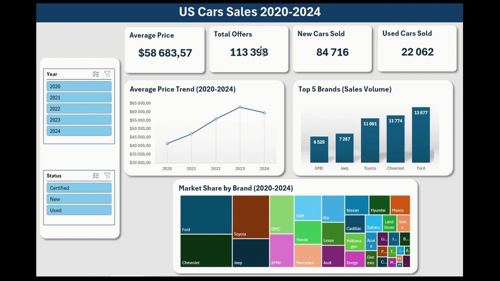

# US-Cars-Sales-2020-2024

# Table of contents
- [Objective](#Objective)
- [Data Source](#Data-Source)
- [Design](#Design)
  - [Dashboard components required](#Dashboard-components-required)
  - [Tools](#Tools)
- [Development](#Development)
  - [Methodology](#Methodology)
  - [Data Exploration](#Data-Exploration)
  - [Data Cleaning](#Data-Cleaning)
- [Visualization](#Visualization)
  - [Dashboard](#Dashboard)
- [Analysis](#Analysis)

# Objective

The objective of this project is to develop an interactive MS Excel dashboard presenting sales data for new and used vehicles in the United States market. The analysis covers the critical pandemic and post-pandemic periods (2020–2024).
The dashboard will help identify key market shifts within the US automotive sector. 
Through interactive visualizations, this tool wil allow for a rapid assessment of the competitive positioning of leading brands.

# Data Source

What do we need to create this dashboard?

- Vehicle Sales Volume
- Status (new or used)
- Price

Data source: [kaggle.com]([https://docs.fastf1.dev/](https://www.kaggle.com/datasets/juanmerinobermejo/us-sales-cars-dataset?resource=download)).

# Design

## Dashboard components required

What are the questions we want the dashboard to answer:
- How has the total sales volume fluctuated from the peak of COVID (2020) to the post-pandemic era (2024)?
- Which segment (New or Used) showed more resilience during the pandemic supply chain shortages?
- Which brands dominate the sales volume in the US market, and has their market share changed since 2020?
- What is the current average market price, and how does it compare to the 5-year historical average?

This may change as we proceed with the analysis.

## Tools

| Tool               | Purpose                               |
|-------------------|---------------------------------------|
| MS Excel+Power Query   | Data evaluation, data cleaning and dashboard creation    |
| GitHub              | Host project documentation        |

# Development

## Methodology

1. Get the data
2. Explore the data
3. Evaluate the data
4. Clean the data
5. Build template for the dashboard
6. Create pivot tables
7. Visualize the data in MS Excel
8. Write documentation

## Data Exploration

What have we learned?
- Data covers the period from 1959 to 2024.
- Some price values are missing.
- We have all the information we need for the dashboard.
- The data is clean and consistent.

## Data Cleaning

What have we done?
- Removed rows with missing price values.
- Filtered the data to include only the years 2020–2024.
- CHanged data types.
  

# Visualization

## Dashboard

# Analysis

### 1. How has the total sales volume fluctuated from the peak of COVID (2020) to the post-pandemic era (2024)?

According to the dataset, new car sales in the US were extremely limited during the peak of the pandemic, with only 15 units sold in 2020 and 50 units in 2021. During this same period, used car sales remained much higher at approximately 6,000 units per year, highlighting a significant market imbalance. This trend shifted dramatically by 2023 as new car sales surged to over 48,000 units while used car sales plummeted to just 3,500 units, indicating a massive recovery in new vehicle inventory and a complete reversal of consumer purchasing patterns.

### 2. Which segment (New or Used) showed more resilience during the pandemic supply chain shortages?

The Used Car segment was significantly more resilient. While new car sales collapsed to nearly zero (15–50 units) due to factory shutdowns and chip shortages, the used market maintained a steady volume of around 6,000 units.

### 3. Which brands dominate the sales volume in the US market?

Ford, Chevrolet, Toyota, and Jeep consistently maintained the largest market share throughout the analyzed period. While Ford dominated the new car segment from 2020 to 2023, the data shows a significant shift in 2024 as the brand fell out of the top five best-selling manufacturers.

### 4. What is the 2024 average market price, and how does it compare to the 5-year historical average?

In 2024, the overall average price reached approximately $63,000, up from $41,000 in 2020. While the used car market followed a similar upward trajectory, the new car market experienced a surprising inversion; prices actually decreased from roughly $70,000 in 2020 to $59,000 in 2024. This suggests that the early pandemic years were characterized by a low-volume, high-luxury sales mix, whereas the 2024 market shifted toward higher inventory levels and more competitively priced mass-market models.
